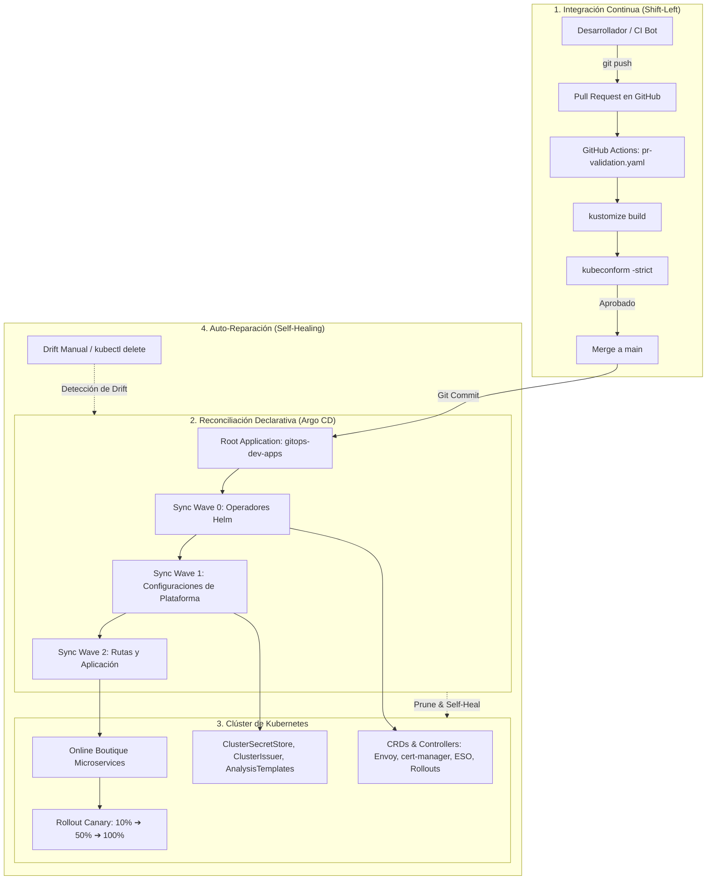

# ☸️ `platform-gitops` — GitOps y Entrega Progresiva en Kubernetes

[](https://github.com/miguelortiz13/platform-gitops/actions/workflows/pr-validation.yaml)
[](https://kustomize.io/)
[](https://github.com/yannh/kubeconform)
[](https://argoproj.github.io/cd/)
[](https://gateway-api.sigs.k8s.io/)
[](https://external-secrets.io/)
[](https://argo-rollouts.readthedocs.io/)

Repositorio central de configuración declarativa del clúster de Kubernetes para el **Proyecto 3 (`platform-gitops`)** del **Laboratorio Integral de DevOps & SRE**. Actúa como la única fuente de verdad (*Single Source of Truth*) para el estado del clúster, gestionado de forma continua por **Argo CD** bajo el modelo pull-based GitOps con sincronización automatizada, auto-reparación (*self-healing*) y entrega progresiva.

---

## 🏗️ 1. Estructura del Repositorio

Siguiendo el estándar empresarial de separación entre **plataforma** y **aplicaciones**, y el patrón canónico de capas base/overlays con **Kustomize**:

```text
platform-gitops/
├── .github/
│   └── workflows/
│       └── pr-validation.yaml          # Pipeline CI: kustomize build + kubeconform strict
├── bootstrap/
│   ├── README.md                       # Guía de arranque del patrón app-of-apps
│   ├── install.sh                      # Script automatizado de bootstrap
│   ├── argocd-values.yaml              # Configuración base del chart de Argo CD
│   └── root-application.yaml           # Manifiesto Application raíz (App-of-Apps)
├── clusters/
│   └── dev/
│       ├── README.md                   # Descripción del estado del clúster dev
│       ├── app-argocd.yaml             # Sync Wave 0: Configuración declarativa de Argo CD
│       ├── app-cert-manager.yaml       # Sync Wave 0: Operador cert-manager Helm
│       ├── app-envoy-gateway.yaml      # Sync Wave 0: Plano de control Envoy Gateway Helm
│       ├── app-external-secrets.yaml   # Sync Wave 0: External Secrets Operator Helm
│       ├── app-argo-rollouts.yaml      # Sync Wave 0: Operador Argo Rollouts Helm
│       ├── app-platform-cert-manager.yaml # Sync Wave 1: ClusterIssuer Let's Encrypt
│       ├── app-platform-external-secrets.yaml # Sync Wave 1: ClusterSecretStore Azure KV
│       ├── app-platform-argo-rollouts.yaml # Sync Wave 1: AnalysisTemplates SLOs
│       ├── app-platform-gateway.yaml   # Sync Wave 2: Gateway y HTTPRoutes
│       ├── app-online-boutique.yaml    # Sync Wave 2: Aplicación Online Boutique
│       └── kustomization.yaml          # Entrypoint de reconciliación para entorno dev
├── platform/                           # Componentes transversales de plataforma
│   ├── cert-manager/                   # ClusterIssuer ACME / Let's Encrypt (P3-04)
│   ├── gateway/                        # Gateway API, HTTPRoute y TLS (P3-04)
│   ├── external-secrets/               # Sincronización Azure Key Vault + Workload ID (P3-05)
│   └── argo-rollouts/                  # AnalysisTemplates de SLOs y progressive delivery (P3-06)
├── apps/
│   └── online-boutique/                # Microservicios Google Online Boutique
│       ├── base/                       # Manifiestos base (10 Deployments + 1 Rollout + Services)
│       └── overlays/
│           ├── dev/                    # Entorno Dev (recursos reducidos, 1-2 réplicas)
│           └── prod/                   # Entorno Prod (alta disponibilidad, recursos garantizados)
├── docs/
│   └── adr/                            # Architecture Decision Records
│       ├── 001-kustomize-manifest-architecture.md
│       ├── 002-gateway-api-vs-ingress.md
│       ├── 003-external-secrets-operator-vs-sealed-secrets.md
│       └── 004-progressive-delivery-argo-rollouts.md
├── .gitignore
└── README.md
```

---

## 🔄 2. Flujo GitOps de Extremo a Extremo



---

## 🌊 3. Patrón App-of-Apps y Olas de Sincronización (*Sync Waves*)

Para evitar condiciones de carrera entre operadores, Custom Resource Definitions (CRDs) y recursos de aplicación, se implementan **Sync Waves declarativas**:

| Wave | Componentes | Propósito | Estrategia de Sincronización |
| :---: | :--- | :--- | :--- |
| **0** | `argo-cd`, `cert-manager`, `envoy-gateway`, `external-secrets`, `argo-rollouts` | Despliegue de los controladores y CRDs base desde charts oficiales de Helm. | `CreateNamespace=true`, `ServerSideApply=true`, `prune: true` |
| **1** | `platform-cert-manager`, `platform-external-secrets`, `platform-argo-rollouts` | Recursos globales de plataforma (`ClusterIssuer`, `ClusterSecretStore`, `AnalysisTemplate`) que dependen de los CRDs de Wave 0. | `prune: true`, `selfHeal: true` |
| **2** | `platform-gateway`, `online-boutique` | Enrutamiento perimetral (`Gateway`, `HTTPRoute`), certificados TLS y los 11 microservicios de la aplicación (incluyendo el `Rollout` frontend). | Dependen de que el plano de datos y secretos estén listos. |

---

## 🛡️ 4. Componentes Transversales de Plataforma

### 4.1. Gateway API y TLS Automatizado (P3-04)
* **Envoy Gateway:** Implementación moderna de capa 7 orientada a roles con Envoy Proxy.
* **HTTPRoute:** Enrutamiento desacoplado que dirige el tráfico perimetral hacia el microservicio `frontend`.
* **cert-manager & ACME:** Emisión y renovación automatizada de certificados TLS mediante el `ClusterIssuer` `letsencrypt-prod`.

### 4.2. External Secrets y Azure Workload Identity (P3-05)
* **Zero Secrets in Git:** Cero secretos en texto plano o cifrados en el repositorio.
* **Autenticación Federada OIDC:** Vinculación directa entre el `ServiceAccount` `external-secrets` y la identidad administrada de Azure (`uami-eso`) con rol `Key Vault Secrets User`.
* **ClusterSecretStore:** Sincroniza dinámicamente claves remotas (ej. `db-password-sample`) desde Azure Key Vault hacia Kubernetes Secrets nativos en memoria de pod.

### 4.3. Entrega Progresiva con Argo Rollouts (P3-06)
* **Canary Release:** El microservicio `frontend` transiciona a través de pasos ponderados:
  $$\text{10\% (pausa 1m)} \longrightarrow \text{50\% (pausa 2m)} \longrightarrow \text{100\% (estable)}$$
* **Servicios Separados:** `frontend` (servicio estable enrutado por Gateway API) y `frontend-canary` (para inspección y pruebas sintéticas de nuevas versiones).
* **AnalysisTemplates:** Plantillas de validación de SLOs preparadas para telemetría Prometheus en P4-07 (tasa de éxito $\ge 95\%$, latencia $P_{99} \le 500\text{ms}$).

---

## 🔧 5. Auto-Reparación y Resiliencia (*Self-Healing*)

Todas las aplicaciones gestionadas por Argo CD tienen habilitadas las políticas:
```yaml
syncPolicy:
  automated:
    prune: true
    selfHeal: true
```

* **Detección de Drift:** Si un operador o atacante modifica manualmente un recurso en el clúster con `kubectl edit` o `kubectl delete`, Argo CD detecta la discrepancia (*OutOfSync*) en segundos.
* **Auto-Reparación:** Argo CD revierte automáticamente el cambio, sobreescribiendo el clúster para restablecer el estado exacto definido en Git (*Single Source of Truth*).

### Verificación Práctica de Auto-Reparación
```bash
# 1. Simular drift eliminando un recurso controlado
kubectl delete service frontend -n online-boutique

# 2. Observar la reconciliación inmediata de Argo CD
kubectl get service frontend -n online-boutique
# => El servicio es recreado automáticamente por Argo CD con los selectores exactos de Git.
```

---

## 🚀 6. Operación de Canarios con CLI (`kubectl-argo-rollouts`)

```bash
# 1. Inspeccionar el estado visual en vivo del Rollout
kubectl argo rollouts get rollout frontend -n online-boutique --watch

# 2. Promover al siguiente paso antes de que expire la pausa
kubectl argo rollouts promote frontend -n online-boutique

# 3. Abortar inmediatamente ante anomalías (desvía el tráfico al 100% stable)
kubectl argo rollouts abort frontend -n online-boutique

# 4. Reintentar un rollout abortado
kubectl argo rollouts retry rollout frontend -n online-boutique

# 5. Rollback instantáneo a la revisión estable anterior
kubectl argo rollouts undo frontend -n online-boutique
```

---

## 📐 7. Decisiones Arquitectónicas (ADRs)

El diseño del repositorio se fundamenta en cuatro Architecture Decision Records:

* [📄 **ADR 001: Estrategia de Manifiestos — Kustomize vs. Helm**](docs/adr/001-kustomize-manifest-architecture.md): Elección de Kustomize para manifiestos de aplicación por su transparencia declarativa y compatibilidad con mutaciones deterministas de CI.
* [📄 **ADR 002: Gateway API vs. Ingress Controller Clásico**](docs/adr/002-gateway-api-vs-ingress.md): Adopción de la especificación SIG Network Gateway API con Envoy Gateway frente a Ingress NGINX legacy.
* [📄 **ADR 003: External Secrets Operator vs. Secretos Cifrados en Git**](docs/adr/003-external-secrets-operator-vs-sealed-secrets.md): Estrategia Zero Secrets in Git mediante federación OIDC con Azure Key Vault frente a Sealed Secrets.
* [📄 **ADR 004: Entrega Progresiva con Argo Rollouts vs. Deployment**](docs/adr/004-progressive-delivery-argo-rollouts.md): Reducción del radio de impacto mediante Canary Releases y rollback automático frente a RollingUpdate estándar.

---

## 🧪 8. Validación Local y Quality Gates

Para validar la sintaxis y los esquemas OpenAPI de todo el repositorio sin necesidad de desplegar un clúster:

```bash
SCHEMA_URL='https://raw.githubusercontent.com/datreeio/CRDs-catalog/main/{{.Group}}/{{.ResourceKind}}_{{.ResourceAPIVersion}}.json'

# Validar overlays de la aplicación
kustomize build apps/online-boutique/base | kubeconform -strict -summary -schema-location default -schema-location "$SCHEMA_URL"
kustomize build apps/online-boutique/overlays/dev | kubeconform -strict -summary -schema-location default -schema-location "$SCHEMA_URL"
kustomize build apps/online-boutique/overlays/prod | kubeconform -strict -summary -schema-location default -schema-location "$SCHEMA_URL"

# Validar aplicaciones del clúster
kustomize build clusters/dev | kubeconform -strict -summary -schema-location default -schema-location "$SCHEMA_URL"

# Validar componentes de plataforma
kustomize build platform/cert-manager | kubeconform -strict -summary -schema-location default -schema-location "$SCHEMA_URL"
kustomize build platform/gateway | kubeconform -strict -summary -schema-location default -schema-location "$SCHEMA_URL"
kustomize build platform/external-secrets | kubeconform -strict -summary -schema-location default -schema-location "$SCHEMA_URL"
kustomize build platform/argo-rollouts | kubeconform -strict -summary -schema-location default -schema-location "$SCHEMA_URL"
```
