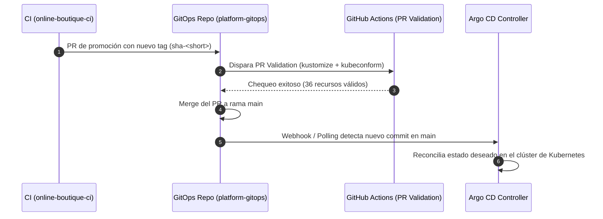

# ☸️ `platform-gitops` — GitOps y Entrega Progresiva en Kubernetes

[](https://github.com/miguelortiz13/platform-gitops/actions/workflows/pr-validation.yaml)
[](https://kustomize.io/)
[](https://github.com/yannh/kubeconform)
[](https://argoproj.github.io/cd/)

Repositorio central de configuración declarativa del clúster de Kubernetes para el **Proyecto 3 (`platform-gitops`)** del **Laboratorio Integral de DevOps & SRE**. Actúa como la única fuente de verdad (*Single Source of Truth*) para el estado del clúster, gestionado de forma continua por **Argo CD** bajo el modelo pull-based GitOps.

---

## 🏗️ 1. Estructura del Repositorio

Siguiendo el estándar empresarial de separación entre **plataforma** y **aplicaciones**, y el patrón canónico de capas base/overlays con **Kustomize**:

```text
platform-gitops/
├── .github/
│   └── workflows/
│       └── pr-validation.yaml          # Pipeline CI: kustomize build + kubeconform
├── bootstrap/
│   ├── README.md                       # Guía de arranque del patrón app-of-apps
│   └── root-application.yaml           # Manifiesto Application raíz para Argo CD
├── clusters/
│   └── dev/
│       ├── README.md                   # Descripción del estado de clúster dev
│       └── kustomization.yaml          # Entrypoint de reconciliación para entorno dev
├── platform/                           # Componentes transversales de plataforma
│   ├── README.md
│   ├── gateway/                        # Gateway API y HTTPRoutes (P3-04)
│   ├── cert-manager/                   # Certificados TLS automatizados (P3-04)
│   ├── external-secrets/               # Sincronización con Azure Key Vault (P3-05)
│   └── argo-rollouts/                  # Progressive Delivery y Canaries (P3-06)
├── apps/
│   └── online-boutique/                # Aplicación de microservicios
│       ├── base/                       # Manifiestos base de los 11 microservicios + redis
│       │   ├── adservice.yaml
│       │   ├── cartservice.yaml
│       │   ├── checkoutservice.yaml
│       │   ├── currencyservice.yaml
│       │   ├── emailservice.yaml
│       │   ├── frontend.yaml
│       │   ├── loadgenerator.yaml
│       │   ├── paymentservice.yaml
│       │   ├── productcatalogservice.yaml
│       │   ├── recommendationservice.yaml
│       │   ├── shippingservice.yaml
│       │   └── kustomization.yaml
│       └── overlays/
│           ├── dev/                    # Entorno de Desarrollo (recursos reducidos, 1 réplica)
│           │   ├── patches/
│           │   │   └── dev-resources.yaml
│           │   ├── namespace.yaml
│           │   └── kustomization.yaml  # Promovido automáticamente por CI (P2-06)
│           └── prod/                   # Entorno de Producción (alta disponibilidad, 2+ réplicas)
│               ├── patches/
│               │   └── prod-resources.yaml
│               ├── namespace.yaml
│               └── kustomization.yaml
├── docs/
│   └── adr/
│       └── 001-kustomize-manifest-architecture.md  # ADR: Kustomize vs Helm
├── .gitignore
└── README.md
```

---

## 📐 2. Decisiones Arquitectónicas (ADRs)

* [📄 **ADR 001: Estrategia de Manifiestos para GitOps — Kustomize vs. Helm**](docs/adr/001-kustomize-manifest-architecture.md): Justifica la elección de Kustomize nativo sobre Helm charts para garantizar transparencia declarativa, parches deterministas entre entornos y mutaciones seguras de imágenes desde CI.

---

## 🛡️ 3. Validación y Quality Gates en CI

Todo cambio propuesto a través de Pull Request es validado automáticamente en GitHub Actions mediante el workflow [`.github/workflows/pr-validation.yaml`](.github/workflows/pr-validation.yaml):

1. **`kustomize build`:** Verifica la integridad sintáctica y la composición de parches en `apps/online-boutique/base`, `overlays/dev`, `overlays/prod` y `clusters/dev`.
2. **`kubeconform -strict`:** Valida cada recurso generado contra los esquemas OpenAPI oficiales de Kubernetes, bloqueando configuraciones no conformes antes de su fusión a `main`.

---

## 🔄 4. Ciclo de Vida de Promoción (CI/CD)


