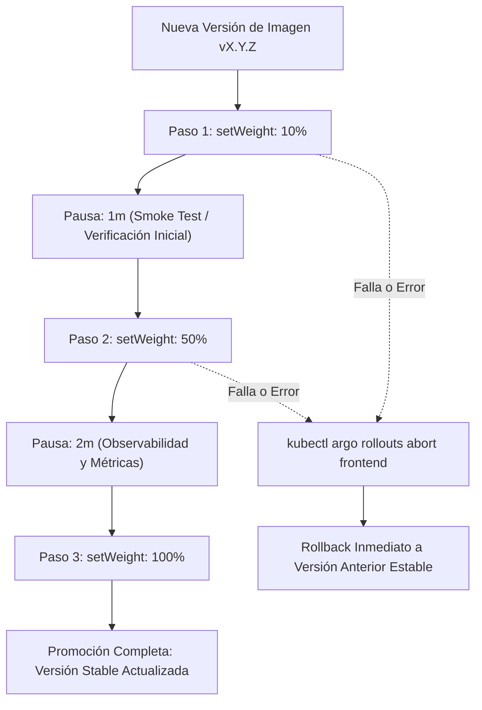

# Argo Rollouts — Entrega Progresiva y Canary Release (P3-06)

> Controlador avanzado de despliegue para Kubernetes que implementa la estrategia **Canary Release** en el microservicio `frontend` de Google Online Boutique, permitiendo validación gradual de nuevas versiones, pausas automatizadas y rollback instantáneo sin impacto en usuarios finales.

---

## 1. Arquitectura y Estrategia Canary

El recurso `Rollout` reemplaza el estándar `Deployment` para gestionar réplicas de forma dinámica a través de pesos porcentuales (*traffic splitting* por réplicas y servicios):



### 1.1. Pasos Configurados (`spec.strategy.canary.steps`)
1. **10% de Tráfico / Réplicas:** Exposición inicial reducida.
2. **Pausa 1 minuto:** Periodo de estabilización y recolección de logs tempranos.
3. **50% de Tráfico / Réplicas:** Carga representativa para detección de cuellos de botella o regresiones.
4. **Pausa 2 minutos:** Ventana de evaluación antes de la adopción total.
5. **100% de Tráfico / Réplicas:** Conmutación definitiva a versión estable.

---

## 2. Servicios Desacoplados: Stable vs. Canary

Para permitir monitoreo diferenciado y routing granular, se definen dos servicios en `online-boutique`:
* **`frontend` (Stable Service):** Apunta a los pods de la versión validada en producción. Es el backend referenciado por `frontend-route` en Gateway API.
* **`frontend-canary` (Canary Service):** Apunta exclusivamente a los pods que ejecutan la nueva versión en evaluación, facilitando pruebas sintéticas y análisis de métricas.

---

## 3. AnalysisTemplates (Preparación para P4-07)

Los recursos `AnalysisTemplate` definidos en `platform/argo-rollouts/analysis-templates.yaml` automatizan la decisión de promover o abortar el despliegue basándose en SLOs de SRE:

* **`frontend-success-rate`:** Requiere una tasa de éxito HTTP $\ge 95\%$ (`sum(rate(http_requests_total{... status!~"5.*"}[1m])) / sum(...)`).
* **`frontend-latency`:** Requiere que la latencia percentil 99 ($P_{99}$) sea $\le 500\text{ms}$.

*(La conexión en tiempo real contra la instancia de Prometheus en el clúster se activa en la tarea P4-07).*

---

## 4. Runbook de Operación con CLI

Para inspeccionar y operar el rollout desde la terminal con el plugin `kubectl-argo-rollouts`:

### 4.1. Visualizar Estado en Vivo
```bash
kubectl argo rollouts get rollout frontend -n online-boutique --watch
```

### 4.2. Promover Manualmente (Avanzar de Paso)
```bash
# Avanzar al siguiente paso sin esperar la pausa
kubectl argo rollouts promote frontend -n online-boutique

# Promover directamente al 100% (omitir pasos restantes)
kubectl argo rollouts promote frontend -n online-boutique --full
```

### 4.3. Abortar Despliegue (Rollback Inmediato)
```bash
kubectl argo rollouts abort frontend -n online-boutique
```

### 4.4. Reintentar o Deshacer
```bash
# Reintentar un rollout abortado
kubectl argo rollouts retry rollout frontend -n online-boutique

# Revertir a la revisión anterior
kubectl argo rollouts undo frontend -n online-boutique
```
