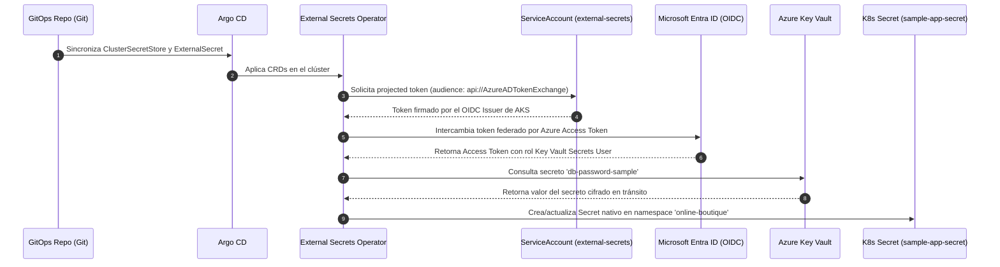

# External Secrets Operator (P3-05)

> Sincronización declarativa de secretos desde **Azure Key Vault** hacia Kubernetes Secrets nativos mediante **Azure Workload Identity** (cero secretos estáticos en Git y en el clúster).

---

## 1. Arquitectura y Flujo de Autenticación

El operador **External Secrets Operator (ESO)** desacopla la gestión de secretos del código y los manifiestos, sincronizándolos automáticamente desde Azure Key Vault en tiempo de ejecución.

---

## 2. Componentes y Recursos

### 2.1. Infraestructura Base en Azure (Terraform `infra-azure-terraform`)
* **Identidad Administrada (`azurerm_user_assigned_identity.eso`):** `uami-eso-devops-sre-dev-eastus2`.
* **Credencial Federada (`azurerm_federated_identity_credential.eso`):** Vincula la UAMI con el ServiceAccount `system:serviceaccount:external-secrets:external-secrets` utilizando el OIDC Issuer del clúster AKS.
* **Asignación RBAC (`azurerm_role_assignment.eso_kv_secrets_user`):** Asigna el rol `Key Vault Secrets User` en el Key Vault correspondiente.

### 2.2. Despliegue de Helm vía Argo CD (`clusters/dev/app-external-secrets.yaml`)
* Despliega el chart oficial `external-secrets/external-secrets` (v2.12.0) en el namespace `external-secrets` con `installCRDs: true` en Sync Wave 0.

### 2.3. ClusterSecretStore (`cluster-secret-store.yaml`)
* Recurso de ámbito clúster que configura el proveedor `azurekv` con `authType: WorkloadIdentity`, apuntando al endpoint de Key Vault (`https://kv-devops-sre-dev.vault.azure.net`) y referenciando el `serviceAccountRef` de ESO.

### 2.4. ExternalSecret de Prueba (`external-secret-sample.yaml`)
* Define la sincronización del secreto `db-password-sample` desde Key Vault hacia el Secret nativo `sample-app-secret` en el namespace `online-boutique` con un intervalo de refresco de 1 hora (`refreshInterval: 1h`) y política de ownership.

---

## 3. Seguridad y Beneficios
* ✅ **Cero Secretos en Git:** Ningún valor sensible ni contraseña reside en el repositorio.
* ✅ **Sin Credenciales Estáticas:** No se utilizan client secrets, certificados ni tokens con fecha de caducidad guardados en Kubernetes.
* ✅ **Rotación Automática:** Los cambios de versión o valor en Key Vault se reflejan automáticamente en los Kubernetes Secrets en cada ciclo de refresco.
